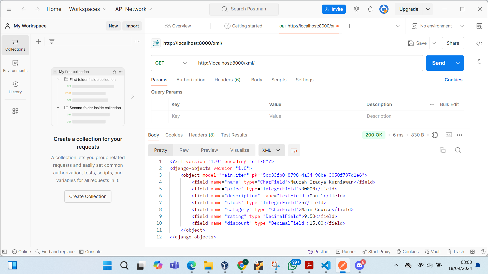
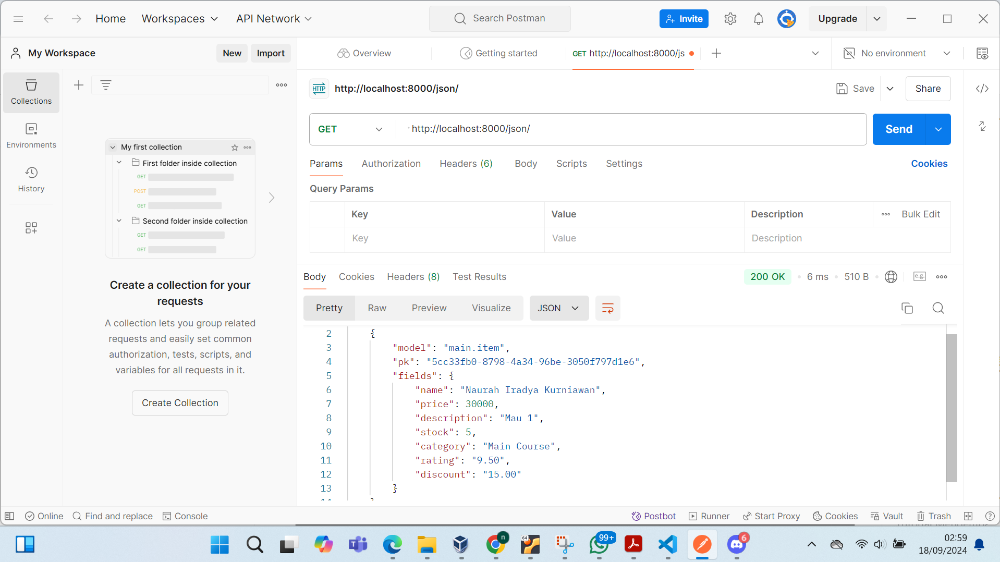
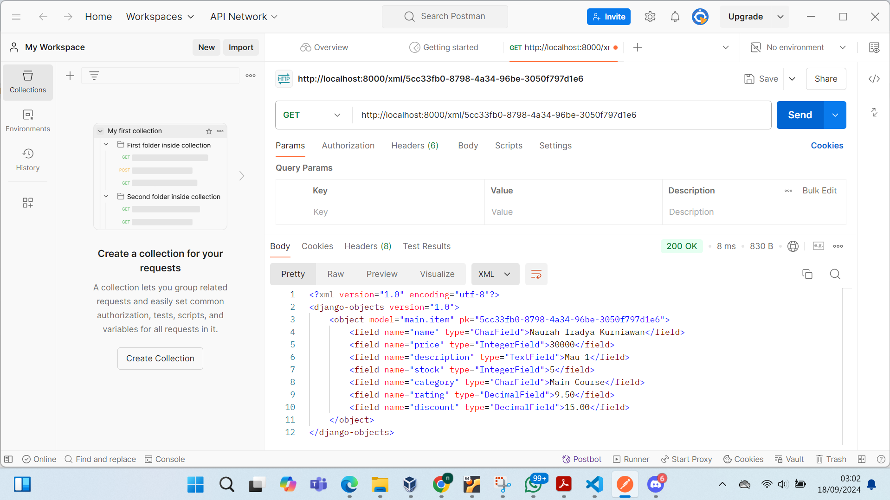
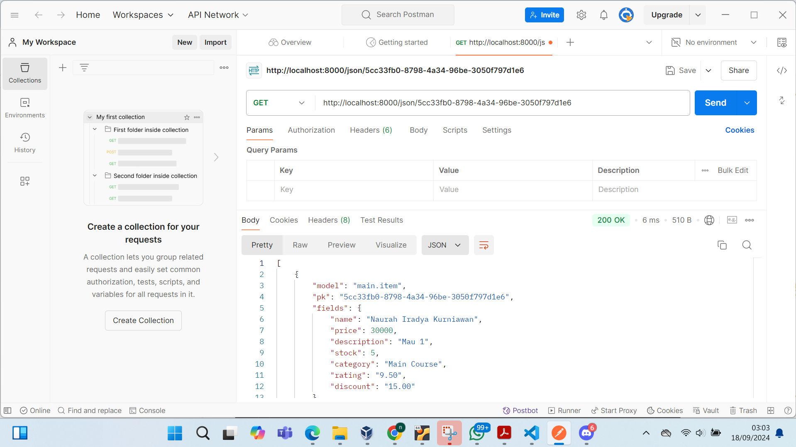

Nama : Naurah Iradya Kurniawan

NPM : 2306245900

Kelas : PBP B

Tugas 2

1) Jelaskan bagaimana cara kamu mengimplementasikan checklist di atas secara step-by-step (bukan hanya sekadar mengikuti tutorial)

Jawaban:

Pada saat pertama kita harus mengetahui bahwa main berupa direktori aplikasi dan mamio merupakan direktori project.

Langkah 1: tahapan pertama yang perlu kita lakukan adalah membuat proyek djanggo baru, pada bagian ini direktori utama yang bernama mamio harus dihubungkan dengan repository yang berada pada github mamio. Tahap ini berfungsi untuk membuat kerangka awal aplikasi django dan menyimpan project yang telah kita buat di GitHub. Jadi nanti kalo semisal ada perubahan kita dapat mengatur dan melacak dengan mudah.

Langkah 2: setelah kita sudah membuat project django, selanjutnya kita harus membuat aplikasi baru. aplikasi ini kita namakan main. aplikasi ini berada di dalam project utama yang bernama mamio. Aplikasi main bertujuan untuk menjadi tempat dimana fitur-fitur khusus dari project mamio dibuat.

Langkah 3: Selanjutnya kita harus mendaftarkan aplikasi main ke dalam project mamio. langkah ini bertujuan untuk memberitahu django bahwa ada aplikasi main dan bisa menjalanannya bersama dengan aplikasi lainnya di proyek ini.

Langkah 4: Setelah itu, kita harus membuat product models.py yang berada di dalam aplikasi main dengan class bernama item. model ini nantinya akan menyimpan data produk ke dalam database. Adapun tujuan dari model sendiri adalah seperti template yang menentukan apa saja yang akan disimpan ke dalam databse. pada model yang saya buat saya menginisiasi beberapa data yang diperlukan diantaranya atribut wajib yaitu nama barang (name), harga barang (price), deskripsi barang (description). selain atribut wajib saya juga menambahkan atribut tambahan seperti stok barang (stock), kategori barang (category), rating dalam suatu barang (rating), tanggal barang ditambahkan (date_added), dan terakhir saya juga memberikan discount barang.

Langkah 5: Langkah ke 5 yaitu membuat direktori template yang berada di dalam aplikasi main. lalu di dalam direktori template tersebut saya buat satu file template yang saya namakan main.html. file ini akan berguna untuk menampilkan datav dari program mamio. pada tahap ini aplikasi belum memiliki data apapun di dalam database.

Langkah 6: Selanjutnya saya membuat suatu fungsi pada file views.py yang terdapat dalam aplikasi main. Hal ini bertujuan untuk menghubungkan data yang terdapat pada model dengan template main.html. Fungsi ini nantinya bertugas untuk mengambil data dari database dan mengirimkannya ke file HTML. tujuannya adalah agar data yang sudah di input dapat terlihat pada website.

Langkah 7: Pada langkah ini saya membuat file urls.py yang berada di aplikasi main. Fungsi dari langkah ini adalah untuk mengatur URL di aplikasi main dan memetakan fungsi yang sudah dibuat di views.py. Fitur ini juga mengatur URL yang bisa diakses pengguna dan setiap URL akan diarahkan ke fungsi tertentu di views.py.

Langkah 8: Selanjutnya saya menambahkan routing pada urls.py pada project mamio. Langkah ini bertujuan untuk memastikan bahwa URL dari project utama dan bisa diarahkan ke aplikasi main yang sebelumnya sudah dibuat.

Langkah 9: Langkah terakhir yang saya lakukan adalah melakukan deployment project mamio ke platform web service (PWS). Hal ini bertujuan untuk membuat project diunggah ke server PWS agar bisa diakses orang lain melalui internet. Setelah ini tampilan platform yang kita buat dapat dilihat pada link yang tertera.

2) Buatlah bagan yang berisi request client ke web aplikasi berbasis Django beserta responnya dan jelaskan pada bagan tersebut kaitan antara urls.py, views.py, models.py, dan berkas html.

Jawaban:

Pada bagan yang saya buat terdapat alur yang memproses jalannya pengolahanan request dari berupa request client hingga menghasilkan suatu output sesuai dengan kemauan client. adapun tahapannya adalah sebagai berikut:

Langkah 1: User membuat request dari internet. Saat user mengakses website, mereka mengirimkan HTTP request ke server.

Langkah 2: Setelah request dikirim web server menerima request tersebut. dan web server bertanggung jawab untuk memproses request HTTP dari internet dan meneruskannya ke aplikasi django.

Langkah 3: Django menerima request dari web server dan memulai siklus request-response. Disini django memeriksa file urls.py untuk mencocokkan URL yang diminta dengan pola URL yang terdaftar.

Langkah 4: Ketika URL cocok, django mengirimkan request ke fungsi atau class view pada views.py. Django mengekstraksi argumen dari request dan meneruskannya ke view.

Langkah 5: Setelah argumen diekstraksi dan view dipanggil langkah berikutnya adalah views.py berkomunikasi dengan models.py untuk mendapatkan data yang relevan dari database.

Langkah 6: Setelah data yang dibutuhkan telah ditemukan pada models.py, data tersebut akan dikembalikan ke view dan kemudian diteruskan ke template HTML untuk ditampilkan kepada user.

Langkah 7: Setelah template sudah sesuai dengan data, django akan mengirimkan HTTP response kembali ke user. Response ini berupa HTML yang ditampilkan di browser user. Pada akhirnya user dapat melihat request yang mereka inginkan.

3) Jelaskan fungsi git dalam pengembangan perangkat lunak!

Jawaban:

Git merupakan sebuah sistem kontrol versi yang sering digunakan dalam pengembangan perangkat lunak. Git berfungsi untuk mengelola perubahan kode secara efisien dan mendukung kolaborasi tim. Dengan git, pengembang dapat melacak setiap perubahan, memulihkan versi sebelumnya, serta bekerja bersama-sama pada proyek dengan lebih terstruktur.

Pertama, git berfungsi sebagai tempat pengelolaan repositori, baik secara lokal di komputer maupun di server github. Pengembang dapat menyimpan dan mengatur proyek mereka di dalam repositori yang dapat diakses kembali kapan saja.

Kedua, git juga berfungsi untuk melacak perubahan kode yang dilakukan. Setiap kali perubahan disimpan dalam commit, git mencatat versi baru proyek beserta informasi seperti siapa yang melakukan perubahan, kapan, dan deskripsi perubahan tersebut.

Ketiga, git juga mendukung kolaborasi tim dengan kemungkinan banyak pengembang dapat bekerja pada salinan lokal proyek, membuat perubahan, dan menggabungkannya kembali ke repositori untama secara terorganisir.

4) Menurut Anda, dari semua framework yang ada, mengapa framework Django dijadikan permulaan pembelajaran pengembangan perangkat lunak?

Jawaban:

Framework pada django seringkali dijadikan sebagai permulaan dalam proses pembelajaran pengembangan perangkat lunak karena relatif mudah dipahami. Django menyediakan dokumentasi yang lengkap dan komunitas yang aktif sehingga pemula dapat dengan cepat memahami konsep dasar pengembangan web.

Djang juga terstruktur dengan baik, sehingga memudahkan pengembang untuk mengatur dan mengelola proyek secara efisien. Struktur yang jelas membantu pemula membangun fondasi pengembangan perangkat lunak yang rapi dan sistematis.

Pendekatan berbasis Model-View-Template (MVT) yang digunakan pada django banyak diterapkan dalam pengembangan perangkat lunak. Dengan mempelajari MTV pemula dapat memahami konsep pemisahan tanggung jawab dalam aplikasi yang sangat penting untuk pengembangan perangkat lunak skala besar.

Selain itu, django memiliki popularitas yang tinggi dan telah digunakan oleh banyak perusahaan besar seperti instagram, pinterest, dan mozilla. Penggunaan django di industri skala besar memberikan keuntungan bagi pemula yang ingin mempelajari teknologi yang banyak diterapkan di dunia kerja.

5) mengapa model pada Django disebut sebagai ORM?

Jawaban:

Model dalam Django disebut ORM (Object-Relational Mapping) karena berfungsi sebagai penghubung antara objek dalam kode Python dan tabel di database relasional. ORM memungkinkan pengembang untuk mengelola dan bekerja dengan data menggunakan objek Python, tanpa perlu menulis query SQL secara manual.

Dengan menggunakan ORM, pengembang bisa melakukan berbagai operasi pada data, seperti menambah, mengubah, atau menghapus data, hanya dengan menggunakan metode dan atribut objek di Python. Ini membuat pengembangan lebih efisien karena pengembang tidak perlu menulis perintah SQL yang rumit. Sebaliknya, ORM secara otomatis menerjemahkan operasi yang dilakukan pada objek Python menjadi perintah SQL yang sesuai dan menjalankannya di database.

Dengan cara ini, ORM menyederhanakan interaksi dengan database dan memungkinkan pengembang untuk fokus pada pengembangan logika aplikasi tanpa harus memikirkan detail teknis dari SQL dan struktur database.

-----------------------------------------------------------------------------------------------------------------------------------------------------------------------------------

Tugas 3

1)  Jelaskan mengapa kita memerlukan data delivery dalam pengimplementasian sebuah platform?

Jawaban:

Data delivery memiliki peran yang sangat penting dalam memastikan bahwa data yang disimpan di server maupun database pusat dapat diakses oleh pengguna di berbagai lokasi secara efisien. Dalam proses pengembangan sebuah platform, data delivery menjadi elemen utama karena platform sering kali harus terhubung dan berinteraksi dengan berbagai layanan lain, seperti layanan basis data, cloud storage, atau sistem autentikasi dapat berfungsi dengan baik. selain itu, proses transfer dan penerimaan data melalui data delivery ini memastikan bahwa data yang diperlukan dapat dikirim dalam format yang tepat dan sesuai dengan kebutuhan spesifik.

Dengan adanya data delivery yang efektif, sistem yang berbeda dapat berkomunikasi secara lebih jelas dan terstruktur, sehingga mereka mampu bekerja sama secara optimal. Selain itu, data delivery yang andal berperan penting dalam menjaga keamanan dan memastikan akurasi data selama proses pertukaran antarplatform. Tanpa mekanisme data delivery yang efisien, komunikasi antar sistem bisa terganggu dan berpotensi menyebabkan kesalahan atau keterlambatan dalam penyampaian informasi. Dengan demikian, data delivery tidak hanya mendukung kinerja platform secara keseluruhan, tetapi juga meningkatkan kolaborasi antar layanan serta memastikan bahwa data tetap aman dan dapat diakses dengan akurat di seluruh sistem.

2) Menurutmu, mana yang lebih baik antara XML dan JSON? Mengapa JSON lebih populer dibandingkan XML

Jawaban:

Baik XML (eXtensible Markup Language) maupun JSON (JavaScript Object Notation) memiliki kegunaan dan kelebihan masing-masing, tetapi JSON lebih populer dalam banyak kasus karena beberapa alasan utama. 

Pertama, JSON memiliki sintaksis yang lebih sederhana dan lebih mudah dibaca dibandingkan XML. JSON menggunakan format objek JavaScript yang langsung dikenali oleh banyak bahasa pemrograman, sedangkan XML memerlukan banyak tag dan atribut yang dapat membuat struktur data menjadi lebih rumit.

Kedua, JSON biasanya menghasilkan ukuran data yang lebih kecil dibandingkan XML. Ini disebabkan oleh fakta bahwa JSON tidak memerlukan tag penutup dan atribut tambahan yang ada di XML, sehingga lebih efisien dalam hal bandwidth dan penyimpanan.

Ketiga, parsing dan penanganan JSON umumnya lebih cepat dibandingkan XML. Format JSON yang lebih sederhana dan tidak memerlukan parsing tag memungkinkan pemrosesan data yang lebih cepat. Selain itu, banyak bahasa pemrograman modern memiliki dukungan bawaan untuk parsing JSON yang memudahkan penggunaannya dalam aplikasi web dan API.

Keempat, JSON secara langsung kompatibel dengan JavaScript yang membuatnya sangat populer dalam pengembangan web. Data JSON dapat dengan mudah diubah menjadi objek JavaScript sehingga memudahkan integrasi dengan aplikasi web. Selain itu, JSON lebih baik dalam menangani struktur data yang kompleks dan mendalam berkat kemampuannya untuk menyimpan data dalam bentuk array dan objek.

Namun, XML juga memiliki kelebihan tersendiri. XML mendukung namespace, validasi skema, dan kemampuan untuk mendokumentasikan metadata secara lebih detail. Hal ini menjadikannya lebih cocok untuk beberapa aplikasi di mana struktur data dan validasi yang ketat diperlukan.

Secara keseluruhan, pemilihan antara XML dan JSON bergantung pada kebutuhan spesifik proyek dan preferensi teknis. Meskipun XML memiliki kelebihan dalam hal struktur dan validasi, JSON sering dipilih karena kemudahan penggunaan dan efisiensi yang lebih baik dalam konteks pengembangan web dan API modern.

3) Jelaskan fungsi dari method is_valid() pada form Django dan mengapa kita membutuhkan method tersebut?

Jawaban:

Method is_valid() pada form djanggo berfungsi untuk memeriksa apakah data yang dikirim melalui form valid atau tidak. Saat pengguna mengisi form dan mengirimkan data, method is_valid() akan otomatis memeriksa data tersebut untuk memastikan semuanya sesuai dengan aturan yang telah ditetapkan dalam form. Hal ini mencakup pengecekan tipe data seperti angka, email, atau URL untuk memastikan semuanya benar sesuai dengan format yang telah ditetapkan. Jika data yang diterima valid maka method ini akan mengembalikan nilai true. Sebaliknya, jika tidak valid maka method ini akan mengembalikan nilai false. Dengan menggunakan method is_valid() pengembang tidak perlu membuat validasi secara manual untuk setiap input. Hal ini disebabkan karena pada method is_valid() sudah menangani semua bentuk validasi secara otomatis. Ini dapat mempermudah proses validasi dan mengurangi kemungkinan kesalahan dalam memeriksa data dari pengguna.

4) Mengapa kita membutuhkan csrf_token saat membuat form di Django? Apa yang dapat terjadi jika kita tidak menambahkan csrf_token pada form Django? Bagaimana hal tersebut dapat dimanfaatkan oleh penyerang?

Jawaban:

csrf_token digunakan untuk meningkatkan keamanan pada aplikasi djanggo. csrf_token memiliki bentuk nilai yang acak dan bersifat unik. Fungsi dari token ini adalah untuk memastikan bahwa setiap permintaan yang dikirim ke server benar-benar berasal dari pengguna yang sah (pengguna sebenarnya) bukan dari pihak yang mencoba memanfaatkan sesi yang sudah aktif untuk melakukan penyerangan. Token ini berfungsi sebagai lapisan perlindungan tambahan terhadap serangan Cross-Site Resquest Forgery (CSRF). 

Melalui token ini, server dapat melakukan validasi token. Pada saat server menerima data, Server akan melalukan pemeriksaan terhadap token. Server akan mengecek apakah token dalam form sesuai dengan token yang disimpan dalam sesi pengguna. Jika token tidak valid atau tidak ada maka server akan menolak permintaan tersebut. Hal ini dilakukan untuk melindungi aplikasi dari potensi serangan. 

csrf_token memiliki peranan penting dalam menjaga keamanan aplikasi. Tanpa adanya csrf_token aplikasi bisa menjadi target serangan CSRF, dimana penyerang dapat menyalahgunakan sesi yang sah untuk melakukan tindakan yang tidak diinginkan atas nama pengguna yang terautentikasi. 

Contoh penyerangan yang terjadi adalah penyerang bisa menyisipkan form berbahaya di situs mereka. Lalu pada saat pengguna yang sudah login mengunjungi situs tersebut form tersebut akan mengirimkan permintaan berbahaya tanpa sepengetahuan pengguna. Hal ini dapat mengakibatkan perubahan data atau pengambilan informasi pribadi.

5) Jelaskan bagaimana cara kamu mengimplementasikan checklist di atas secara step-by-step (bukan hanya sekadar mengikuti tutorial).
Jawaban:

Langkah 1: Membuat direktori templates dan file HTML
Langkah ini berfungsi untuk menyiapkan struktur dasar tampilan aplikasi web. Dengan membuat direktori templates pada folder utama proyek dan file base.html dapat membangun kerangka umum yang akan digunakan untuk menyusun halaman-halaman web lainnya. Ini memastikan bahwa elemen-elemen seperti header, footer, dan layout konsisten pada seluruh aplikasi.

Langkah 2: Melakukan konfigurasi pengaturan pada settings.py dan menyusun main.html
Pada langkah ini, saya mengatur django untuk mengenali direktori templates dengan memperbarui settings.py khususnya pada bagian DIRS. Hal ini memastikan django dapat menemukan dan menggunakan template HTML yang telah dibuat. Kemudian saya juga menambahkan  dan  pada main.html.Hal ini berguna untuk menghubungkan template dengan base.html dan menentukan area dimana konten spesifik ditampilkan.

Langkah 3: Menyiapkan model dan melakukan migrasi
Pada langkah ini saya melibatkan penambahan import uuid dalam models.py dan mendefinisikan model data, seperti item produk yang akan disimpan dalam database. Setelah mendefinisikan model saya melakukan migrasi untuk memperbarui skema database dengan perintah python manage.py makemigrations dan python manage.py migrate. hal ini memudahkan saya untuk menyimpan dan mengelola data produk dengan benar di database.

Langkah 4: Membuat form input data dan menampilkan item entry pada html
Pada langkah ini, saya membuat sebuah form input dengan membuat berkas forms.py yang berisi ItemForm untuk model Item. Di sini, saya mendefinisikan field yang akan digunakan dalam form, seperti name, price, description, stock, category, rating, dan discount yang nantinya digunakan untuk menangkap input data dari pengguna. Form ini memungkinkan saya untuk memproses dan menyimpan data baru ke dalam database dengan mudah. Selanjutnya, saya mengintegrasikan form tersebut dalam fungsi create_item pada views.py untuk menampilkan form dan menangani penyimpanan data. Setelah itu, saya memodifikasi template create_item.html agar form bisa diakses dan menambahkan fungsi validasi untuk memastikan data yang diinput valid sebelum disimpan ke database. Hal ini penting agar aplikasi dapat menerima entri baru dan menampilkannya dengan baik di halaman utama. Setelah itu, saya melakukan perintah python manage.py runserver dan membuka http://localhost:8000/ Fungsi dari langkah ini adalah untuk menjalankan aplikasi Django di server lokal dan memastikan bahwa data yang ditambahkan melalui form dapat terlihat di halaman utama aplikasi saat diakses melalui browser.

Langkah 5: Mengembalikan data dalam bentuk XML
Pada langkah ini, saya menambahkan fungsi baru dalam views.py yang mengubah data dari model Item menjadi format XML menggunakan serializers. Fungsi ini mengembalikan data yang sudah diserialisasi sebagai HttpResponse dengan tipe konten "application/xml". Saya kemudian mengupdate urls.py untuk mengarahkan URL tertentu ke fungsi ini, memungkinkan akses data XML melalui browser. Setelah konfigurasi, saya menjalankan proyek dan memverifikasi hasilnya di browser untuk memastikan data ditampilkan dalam format XML.

Langkah 6: Mengembalikan data dalam bentuk JSON
Pada langkah ini, saya membuat fungsi show_json di views.py untuk mengubah data dari model Item menjadi format JSON menggunakan serializers. Fungsi ini mengembalikan data yang telah diserialisasi sebagai HttpResponse dengan tipe konten "application/json". Setelah itu, saya memperbarui urls.py untuk menambahkan path URL yang mengarah ke fungsi show_json, memungkinkan akses data JSON melalui browser. Terakhir, saya menjalankan proyek dan memeriksa hasilnya di browser untuk memastikan data ditampilkan dalam format JSON.

Langkah 7: Mengembalikan Data Berdasarkan ID dalam Bentuk XML dan JSON
Pada langkah ini, saya menambahkan dua fungsi di views.py, yaitu show_xml_by_id dan show_json_by_id, yang mengambil data berdasarkan ID dari model Item dan mengembalikannya dalam format XML atau JSON. Fungsi-fungsi ini menggunakan metode untuk mengubah data menjadi format XML atau JSON dan mengirimkannya sebagai HttpResponse dengan tipe konten yang sesuai. Saya kemudian memperbarui urls.py untuk menambahkan path URL yang mengarah ke kedua fungsi tersebut, sehingga data dapat diakses melalui browser dengan menyesuaikan ID pada URL. Setelah itu, saya menjalankan proyek untuk memeriksa hasilnya di browser.

Langkah 8: Menggunakan postman debagai data viewer
Pada langkah ini, saya menjalankan server dengan perintah python manage.py runserver dan menggunakan Postman untuk menguji API. Saya membuat request GET di Postman dengan URL seperti http://localhost:8000/xml/ atau http://localhost:8000/json/ untuk memastikan data dikirim dengan benar. Saya juga dapat mengubah URL untuk menguji pengambilan data berdasarkan ID, seperti http://localhost:8000/xml/[id] atau http://localhost:8000/json/[id]. Hasil response dapat dilihat di bagian bawah Postman untuk memverifikasi bahwa data yang diinginkan muncul sesuai dengan format yang diharapkan.

Langkah 9: Melakukan Push Ke PWS Secara Otomatis Menggunakan GitHub Actions
Pada langkah ini, saya membuat otomatisasi untuk deployment ke PWS menggunakan GitHub Actions. Saya membuat file konfigurasi deploy.yml di dalam subdirektori .github/workflows yang mengatur GitHub Actions untuk secara otomatis melakukan push ke PWS setiap kali saya melakukan push ke branch main di GitHub. Selain itu, saya menambahkan URL PWS sebagai secret di pengaturan repositori GitHub untuk otentikasi, dan memperbarui settings.py proyek dengan URL PWS. Setelah melakukan commit dan push, GitHub Actions akan memproses deployment secara otomatis, memudahkan manajemen deployment ke PWS. Setelah itu, saya melakukan add, commit, dan push ke repositori GitHub menggunakan perintah git add ., git commit -m "<pesan_commit>", dan git push -u origin <branch_utama>, dengan menyesuaikan pesan commit dan nama branch utama sesuai kebutuhan. Ini memastikan bahwa perubahan terbaru di direktori lokal saya diperbarui ke repositori GitHub.

Hasil akses url pada postmane:

-----------------------------------------------------------------------------------------------------------------------------------------------------------------------------------
Tugas 4
1) Apa perbedaan antara HttpResponseRedirect() dan redirect()

Jawab:

2) Jelaskan cara kerja penghubungan model MoodEntry dengan User!

Jawab:

3) Apa perbedaan antara authentication dan authorization, apakah yang dilakukan saat pengguna login? Jelaskan bagaimana Django mengimplementasikan kedua konsep tersebut.

Jawab:

4) Bagaimana Django mengingat pengguna yang telah login? Jelaskan kegunaan lain dari cookies dan apakah semua cookies aman digunakan?

Jawab: 

5) Jelaskan bagaimana cara kamu mengimplementasikan checklist di atas secara step-by-step (bukan hanya sekadar mengikuti tutorial).

Jawab:

